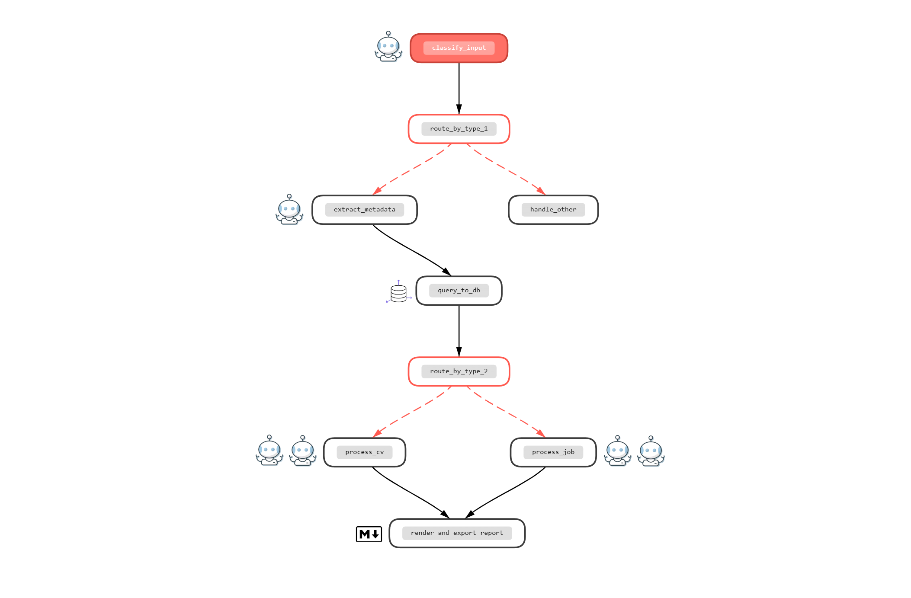

# OS Multiagent System

An open-source multiagent system for talent selection using advanced AI techniques. This system leverages multiple specialized agents to **analyze candidate profiles and job requirements, providing intelligent matching and insights**.

Tech Stack:
- [**CrewAI**](https://docs.crewai.com/en/quickstart) - Multi-agent orchestration framework
- [**ChromaDB**](https://docs.trychroma.com/docs/overview/getting-started) - Vector database for semantic search and embeddings
- [**OpenRouter**](https://openrouter.ai/) - LLM provider using `arcee-ai/trinity-large-preview:free` (free tier)
- [**Jina**](https://jina.ai/) - Embedding model `jina-embeddings-v2-base-en` for semantic embeddings (free tier)
- [**Chainlit**](https://docs.chainlit.io/get-started/overview) - LLM application UI framework

## Table of Contents

1. [Agents Workflow](#agents-workflow)
2. [How to Run](#how-to-run)
3. [Data Sources](#data-sources)
4. [Code Quality & Documentation](#code-quality--documentation)
    - [Pre-commit Hooks](#pre-commit-hooks)
    - [Unit Testing](#unit-testing)
    - [Peer Review](#peer-review)
5. [Virtual Environment](#virtual-environment)
    - [Create a new virtualenv with the project's dependencies](#create-a-new-virtualenv-with-the-projects-dependencies)
    - [Checking if the project's virtual environment is active](#checking-if-the-projects-virtual-environment-is-active)
    - [Updating the project's dependencies](#updating-the-projects-dependencies)
6. [TODO](#todo)

## Agents Workflow



### Roles Overview
- 🤖 Professional Document Classifier
- 🤖 CV Metadata Extractor
- 🤖 Job Metadata Extractor
- 🤖 Skill Gap Identifier
- 🤖 Interview Question Generator

## How to Run

This project provides two ways to run the Talent Selection workflow:

### 🧠 1. Run the CrewAI Flow (Python)

You can execute the complete multi‑agent workflow programmatically using the `flow.kickoff_async()` method:

```python
from IPython.display import Markdown, display
from src.talent_selection_flow.flow import TalentSelectionFlow

job_example = """
# JOB POSTING: Senior Backend Engineer (AI Systems)

## POSITION OVERVIEW
We are seeking a Senior Backend Engineer to join our AI Orchestration team. 
The ...
...
... 
"""
response = await TalentSelectionFlow(verbose=False).kickoff_async(
    inputs={"raw_input": job_example}
)

display(Markdown(response))
```
### 💬 2. Run the Chat Interface (Chainlit)
Interact with the Expert HR Consultant agent using a conversational UI powered by Chainlit.

Start the app:
```shell
chainlit run app.py
```
After launching, open the URL shown in the terminal (typically: http://localhost:8000).
The Chainlit interface allows you to:
- Upload document and run `TalentSelectionFlow`
- Ask questions about job descriptions or CVs (🤖 Expert HR Consultant)
- More details [here](chainlit.md)

## Data Sources
The system uses two primary datasets sourced from Kaggle to train and evaluate the CV-to-job matching algorithms:
- CV data: https://www.kaggle.com/datasets/snehaanbhawal/resume-dataset
- Job posts data: https://www.kaggle.com/datasets/shivamb/real-or-fake-fake-jobposting-prediction

## Code Quality & Documentation
### Pre-commit Hooks
---
This project uses [pre-commit](https://pre-commit.com/) hooks to enforce code quality standards automatically before each commit. The following hooks are configured:

- **Formatting & File Integrity**: `trailing-whitespace`, `end-of-file-fixer`, `check-yaml`, `check-toml`
- **Code Linting & Formatting**: `ruff-check`, `ruff-format`
- **Type Checking**: `mypy`

Pre-commit hooks are automatically installed during virtual environment setup (`uv sync`). To run them manually:
```bash
.venv\Scripts\activate
pre-commit run
```

### Unit Testing
---
Unit tests ensure code reliability and prevent regressions. Tests are written using pytest and should cover critical functionality.

To run all tests:
```bash
uv run pytest
```

To run tests with coverage:
```bash
uv run pytest --cov
```

### Peer Review
---
All code contributions are subject to peer review. Detailed review guidelines and standards are documented in the project's peer review guidelines document.

TBD

## Virtual Environment
### Create a new virtualenv with the project's dependencies
---
Install the project's virtual environment and set it as your project's Python interpreter.
This will also install the project's current dependencies.

Open a terminal in VSCode, then execute the following commands:

1. Install [UV: Python package and project manager](https://docs.astral.sh/uv/getting-started/installation/):
    * On Mac OSX / Linux: `curl -LsSf https://astral.sh/uv/install.sh | sh`
    * On Windows [In Powershell]: `powershell -ExecutionPolicy ByPass -c "irm https://astral.sh/uv/install.ps1 | iex"`

2. [optional] To create virtual environment from scratch with `uv`: [Working on projects](https://docs.astral.sh/uv/guides/projects/)

3. If the environment already exists, install the virtual environment. It will be installed in the project's root, under a new directory named `.venv`:
    * `uv sync`
    * `uv sync --group dev --group dashboard --group test` to install all the dependency groups

4. Activate the new virtual environment:
    * On Mac OSX / Linux: `source .venv/bin/activate`
    * On Windows [In Powershell]: `.venv\Scripts\activate`

5. Configure / install pre-commit hooks:
    * [Pre-commit](https://pre-commit.com/) is a tool that helps us keep the repository complying with certain formatting and style standards, using the `hooks` configured in the `.pre-commit-config.yaml` file.
    * Previously installed with `uv sync`.

### Checking if the project's virtual environment is active
---
All commands listed here assume the project's virtual env is active.

To ensure so, execute the following command, and ensure it points to: `{project_root}/.venv/bin/python`:
* On Mac OSX / Linux: `which python`
* On Windows / Mac OSX / Linux: `python -c "import sys; import os; print(os.path.abspath(sys.executable))"`

If not active, execute the following to activate:
* On Mac OSX / Linux: `source .venv/bin/activate`
* On Windows [In Powershell]: `.venv\Scripts\activate`

Alternatively, you can also run any command using the prefix `uv run` and `uv` will make sure that it uses the virtual env's Python executable.

### Updating the project's dependencies
---
#### Adding new dependencies
---
In order to avoid potential version conflicts, we should use uv's dependency manager to add new libraries additional to the project's current dependenies.
Open a terminal in VSCode and execute the following commands:

* `uv add {dependency}` e.g. `uv add pandas`

This command will update the project's files `pyproject.toml` and `uv.lock` automatically, which are the ones ensuring all developers and environments have the exact same dependencies.

#### Updating your virtual env with dependencies recently added or removed from the project
---
Open a terminal in VSCode and execute the following command:
* `uv sync`

## TODO
- Add top_k from input optional
- Add docstrings
- Add unit tests
- Add max_iter and max_rpm to control rate limits in agents
- Add agent that gets profiles from linkedin in JobToCVCrew
    - https://github.com/crewAIInc/crewAI-examples/blob/main/crews/recruitment/src/recruitment/tools/linkedin.py
    - add reasoning True with max_reasoning_attempts
- Tools:
    - crewai: https://docs.crewai.com/en/concepts/tools
    - langchain: https://docs.langchain.com/oss/python/integrations/tools
- Crewai examples: https://docs.crewai.com/en/examples/example